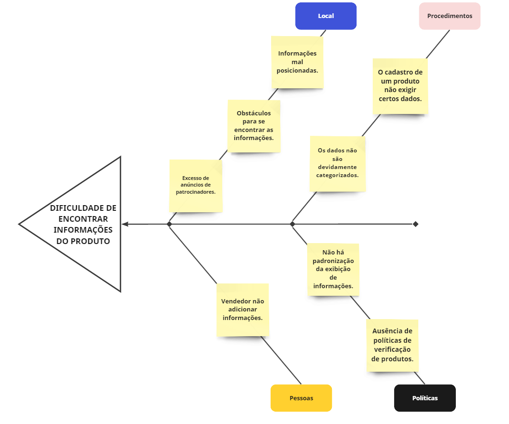

## Introdução

O Diagrama de Causa e Efeito, ou de Ishikawa, é uma ferramenta desenvolvida por Kaoru Ishikawa que possui por finalidade a identificação das causas de um entrave. Para tal, utiliza-se de categorias básicas de causas, a depender da natureza do problema. Dado que a vicissitude em questão é de natureza operacional, os grupos básicos recomendados são: máquina, material, método, mão de obra, medida e instalações/ambiente [1](#referências-bibliográficas). 

## Metodologia 

## Diagrama 

<!-- <iframe width="768" height="432" src="https://miro.com/app/live-embed/uXjVMmeFF9o=/?moveToViewport=1971,-1737,3492,1730&embedId=192965594030" frameborder="0" scrolling="no" allow="fullscreen; clipboard-read; clipboard-write" allowfullscreen></iframe> -->

Figura 1 - Diagrama Causa-Efeito

     

Fonte: [Arthur de Melo](https://github.com/arthurmlv) e [Douglas Alves](https://github.com/dougalvs), 2023

## Referências Bibliográficas

> <a id="REF1" href="#anchor_1">1.</a> LINS, B. F. E. Ferramentas básicas da qualidade. Ciência da Informação, [S. l.], v. 22, n. 2, 1993. DOI: 10.18225/ci.inf.v22i2.502. Disponível em: https://revista.ibict.br/ciinf/article/view/502. Acesso em: 12 set. 2023.

## Histórico de Versões

| Versão | Data       | Descrição                                    | Autor(es)                                        | Revisor(es)                                      |
| ------ | ---------- | -------------------------------------------- | ------------------------------------------------ | ------------------------------------------------ |
| `1.0`  | 12/09/2023 | Criação do diagrama.                           | [Arthur de Melo](https://github.com/arthurmlv) e [Douglas Alves](https://github.com/dougalvs) | [Sidney Fernando](https://github.com/nando3d3) |
