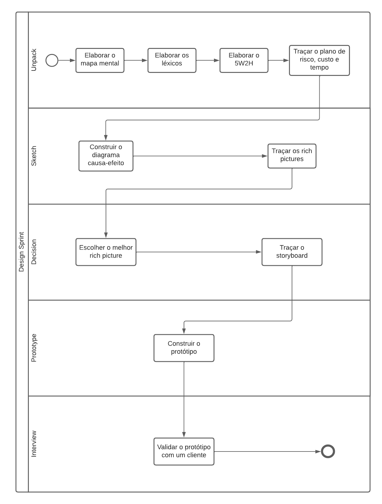

# 1.2. Módulo Processos/Metodologias/Abordagens

## Metodologia Adotada

Conforme destacado por Sommerville (2018)[¹](#ancora1), o projeto de arquitetura desempenha um papel fundamental no desenvolvimento de software, atuando como o estágio inicial do processo. Nesse estágio são identificados os principais componentes estruturais do sistema e seus relacionamentos, resultando em um modelo de arquitetura que descreve como o sistema será organizado.

A escolha metodológica nesse contexto é um fator crucial, pois influencia diretamente na forma como a arquitetura será projetada e implementada, podendo impactar significativamente na qualidade e no sucesso do projeto de software. Dessa forma, no seguinte projeto, serão adotados elementos das seguintes ferramentas e metodologias: Scrum, XP (Extreme Programming), Conventional Commits e BPMN (Business Process Model And Notation).

## Scrum

O Scrum, segundo Fábio Cruz (2013)[²](#ancora2), é um _framework_ amplamente utilizado no gerenciamento de projetos ágeis. Embora frequentemente associado ao desenvolvimento de software, sua flexibilidade o torna applicável a qualquer tipo de produto. Uma de suas características distintivas é sua abordagem iterativa e incremental. No âmbito do Scrum, os projetos são divididos em ciclos curtos e repetitivos, conhecidos como "Sprints". As sprints, que geralmente possuem uma duração de duas a quatro semanas, possibilitam a adaptação e correção de desvios a cada iteração.

Conforme Fábio Cruz (2013)[²](#ancora2), as sprints são compostas por cerimônias do Scrum e incluem: A Sprint Planning, na qual são definidas as metas e tarefas da sprint. A Sprint Backlog, que registra as tarefas específicas a serem executadas na sprint atual. A Sprint Review, que verifica se os artefatos realizados estão satisfatórios. A Sprint Retrospective, que acontece após a revisão e permite a equipe analisar o que funcionou bem e o que pode ser melhorado. E finalmente, a Daily Scrum, que é uma reunião curta e diária para compartilhar o progresso da sprint.

No projeto em questão, optou-se por uma abordagem adptada do Scrum, adotando os seguintes elementos: Sprint Planning, Sprint Backlog e Sprint Review. Para mais detalhes sobre como essas cerimônias foram alocadas no decorrer da sprint, acessar o tópico [BPMN (Business Process Model and Notation)](#bpmn-business-process-model-and-notation).

## XP (Extreme Programming)

O XP ou Extreme Programming é um processo de desenvolvimento voltado para projetos com requisitos vagos e que mudam com frequência, com desenvolvimento incremental e preferencialmente com equipes pequenas de até 12 desenvolvedores. Ele é estruturado em um conjunto de práticas e valores que funcionam de maneira harmoniosa para garantir um alto retorno do investimento em software para o cliente. Dentro do XP, quatro valores fundamentais orientam o desenvolvimento de software: feedback, comunicação, simplicidade e coragem. Entre as práticas incluídas no XP estão: cliente presente, jogo do planejamento, stand up meeting, programação em par, desenvolvimento guiado pelos testes, refactoring, código coletivo, código padronizado, design simples, metáfora, ritmo sustentável, integração contínua e releases curtos (VINÍCIUS MANHÃES TELES, 2017)[³](#ancora3).

No seguinte projeto, optou-se por adaptar a prática programação em pares e utilizá-la no decorrer da sprint. Para mais detalhes de como a Execução em pares será abordada durante o andamento da sprint, acessar o tópico [BPMN (Business Process Model and Notation)](#bpmn-business-process-model-and-notation).

## Política de Commits

Com o objetivo de aprimorar a organização e a rastreabilidade do projeto, optou-se por utilizar o Conventional Commits[⁴](#ancora4), que é uma convenção para estruturar e padronizar as mensagens de commit em repositórios de controle de versão.

As mensagens de commit são formatadas de acordo com um conjunto de regras predefinidas, seguindo o seguinte padrão:

#### Estrutura da Mensagem de Commit:

```
<tipo>[escopo opcional]: <descrição>

[corpo opcional]

[rodapé(s) opcional(is)]
```

#### Tipos de Commits:

- feat - cria um novo recurso no código.
- fix - corrige um bug no código.
- style - mudanças que não afetam o significado do código
- refactor - uma alteração que não corrige um bug, nem adiciona um novo recurso.
- test - adicionando testes ausentes ou corrigindo testes existentes.
- docs - apenas a documentação.
- chore - alterações no processo de compilação ou ferramentas e bibliotecas auxiliares, como geração de documentação.
- perf - udança de Código que melhora performance.
- build - alterações que afetam o sistema de compilação ou dependências externas (npm, gulp, broccoli).
- ci - alterações em nossos arquivos e scripts de configuração de CI (Travis, Circle, github actions).

## Política de Branchs

A criação de branchs deverão seguir o padrão:

```
<tipo>/<descrição>
```

#### Tipos de Branchs:

As branchs serão divididas em 3 tipos: feat, fix e refactor.

- feat - branch que cria um novo recurso.
- fix - branch que corrige algum problema ou erro existente no código.
- refactor - branch que modifica elementos já existentes, mas não corrige e nem adiciona um novo recurso.

## BPMN (Business Process Model and Notation)

O BPMN é uma ferramenta gráfica que é utilizada para expressar os processos de negócio em forma de diagramas. Sua principal função é fornecer uma linguagem visual compreensível que permite mapear de forma clara e consistente todos os processos que ocorrem dentro de uma organização. O BPMN desempenhará um papel fundamental ao ajudar a ilustrar como as metodologias ágeis, como Scrum, XP (Extreme Programming) e a Design Sprint, podem ser aplicadas de maneira estruturada e eficaz.

## Símbolos e Elementos do Diagrama

A figura 1 ilustra essas quatro categorias de elementos usadas em diagramas BPMN:

<center>
Figura 1 - Elementos da Modelagem BPMN
<table border="1">
    <tr>
        <th>Elementos</th>
        <th>Processos</th>
        <th>Definição</th>
        <th>Símbolos</th>
    </tr>
    <tr>
        <td rowspan="3">Objetos de Fluxo</td>
        <td>Eventos</td>
        <td>Gatilho que inicia, modifica ou conclui um processo com vários tipos de eventos, representados por círculos contendo símbolos específicos, classificados como "lançadores" ou "captadores" conforme sua função.</td>
        <td></td>
    </tr>
    <tr>
        <td>Atividades</td>
        <td>Uma ação ou tarefa específica executada e visualizada como um retângulo com cantos arredondados. Essa representação pode ser enriquecida com detalhes adicionais, como subprocessos, iterações, compensações e execuções simultâneas.</td>
        <td></td>
    </tr>
    <tr>
        <td>Pontos de Decisão</td>
        <td>Ponto de decisão que pode ajustar o caminho com base em condições ou eventos. São representados como losangos. Eles podem ser exclusivos ou inclusivos, paralelos, complexos ou baseados em dados ou eventos.</td>
        <td></td>
    </tr>
    <!-- Segunda linha -->
    <tr>
        <td rowspan="3">Conector de objetos</td>
        <td>Fluxo de Sequência</td>
        <td>
Mostra a ordem das atividades a serem realizadas. É representado como uma linha reta com uma seta. Pode indicar um fluxo condicional ou um fluxo padrão.</td>
        <td></td>
    </tr>
    <tr>
        <td>Fluxo de Mensagem</td>
        <td>Mostra a comunicação que atravessa "pools" ou fronteiras organizacionais, como departamentos, evitando conexões entre eventos ou atividades internas ao "pool". É indicado por uma linha tracejada com um círculo no início e uma seta no final.</td>
        <td></td>
    </tr>
    <tr>
        <td>Associação</td>
        <td>Indicado por uma linha tracejada, conecta um artefato ou texto a um evento, atividade ou gateway específico.</td>
        <td></td>
    </tr>
    <!-- Terceira linha -->
    <tr>
        <td rowspan="1">Swimlanes(Raias)</td>
        <td>pool ou Lane</td>
        <td>Uma "pool" representa os participantes principais de um processo. Essas "pools" podem ser de diferentes empresas ou departamentos, mas ainda estão relacionadas ao processo. Dentro de cada "pool," as "swimlanes" indicam as atividades e o fluxo específico para um papel ou participante, definindo claramente quem é responsável por quais partes do processo.</td>
        <td></td>
    </tr>
    <!-- Quarta linha -->
    <tr>
        <td rowspan="1">Artefato</td>
        <td>Dado, grupo e anotação</td>
        <td>
Os artefatos são elementos adicionados a um diagrama para enriquecê-lo com informações. Um "objeto de dados" identifica dados essenciais, um "grupo" organiza atividades logicamente sem impactar o fluxo, e uma "anotação" oferece esclarecimentos adicionais em seções do diagrama. Esses elementos contribuem para a compreensão e completude do diagrama.</td>
        <td></td>
    </tr>
</table>

<font>Fonte: [Sidney Fernando](https://github.com/nando3d3), 2023.</font>
</center>

## Diagramas

A figura 2 ilustra as escolhas metodológicas do projeto e como funciona o fluxo de trabalho de uma sprint, evidenciando o uso adaptado do SCRUM e do XP, de forma a se entregar os artefatos de uma entrega.

<center>
Figura 2 - Diagrama BPMN de Escolhas Metodológicas

 </br>

<font>Fonte: [Douglas Alves](https://github.com/dougAlvs) e [Sidney Fernando](https://github.com/nando3d3), 2023.</font>
</center>

<br>

Já a figura 3 evidencia as etapas da design sprint e a relação entre os artefatos da primeira entrega. Para mais detalhes ler o [documento da design sprint](Base/1.1.AbordagemNaoEspecifica.md).

<center>
Figura 3 - Diagrama BPMN da Design Sprint

</br>


<font>Fonte: [Douglas Alves](https://github.com/dougAlvs) e [Sidney Fernando](https://github.com/nando3d3), 2023</font>

</center>

## Bibliografia

> SGANDERLA, Kelly. <b>Um guia para iniciar estudos em BPMN (I)<b>: atividades e sequência. Atividades e sequência. 2012. Disponível em: https://blog.iprocess.com.br/2012/11/um-guia-para-iniciar-estudos-em-bpmn-i-atividades-e-sequencia/. Acesso em: 12 set. 2023.
> 
> LUCIDCHART. What is Business Process Modeling Notation. Disponível em: https://www.lucidchart.com/pages/bpmn. Acesso em: 13 set. 2023.

## Referências Bibliográficas

> <a id="ancora1"></a> 1. SOMMERVILLE, I. Software engineering. 10. ed. [s.l.] Boston, Mass. Amsterdam Cape Town Pearson Education Limited, 2016.  
> <a id="ancora2"></a> 2. CRUZ, F. Scrum e PMBOK unidos no Gerenciamento de Projetos. [s.l.] Brasport, [s.d.].  
> <a id="ancora3"></a> 3. VINÍCIUS MANHÃES TELES. Extreme Programming. [s.l.] Novatec Editora, 2017.  
> <a id="ancora4"></a> 4. CONVENTIONAL Commits. Conventional Commits. Disponível em: <https://www.conventionalcommits.org/pt-br/v1.0.0/#especificação/>. Acesso em: 15 set. 2023.  
> <a id="ancora5"></a> 5. BPMN (Business Process Model and Notation). Universidade de Brasília (UNB). Disponível em: <https://www.dpo.unb.br/images/phocadownload/dpr/biblioteca/BPMN.pdf>. Acesso em: 15 set. 2023.

 
## Histórico de Versões

| Versão | Data       | Descrição            | Autor(es)                                           | Revisor(es) |
| ------ | ---------- | -------------------- | --------------------------------------------------- | ----------- |
| `1.0`  | 15/09/2023 | Criação do documento | [Maciel Júnior](https://github.com/macieljuniormax) |             |
| `1.1`  | 15/09/2023 | Adição do BPMN | [Débora Caires](https://github.com/deboracaires) |             |
| `1.2`  | 15/09/2023 | Mesclagem com a página do BPMN | [Douglas Alves](https://github.com/dougalves) e [Sidney Fernando](https://github.com/nando3d3) |             |
