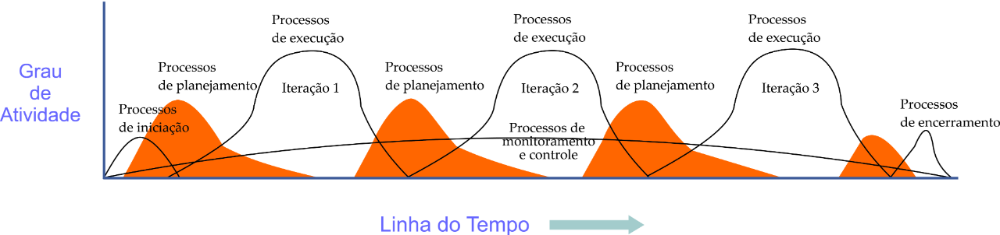

# 1.1.x Plano de Tempo

## Introdução

O objetivo desta página é documentar o planejamento para gerenciar o tempo

## Tabela de Disponibilidade

<iframe src="https://docs.google.com/spreadsheets/d/e/2PACX-1vQhjfSf_VjGWHEMpdYINRaRrQD0LcXnXMFsbwrBdIooLjM7BllbLj3VYCQElRJMSYjBVSk0YtzyVkyh/pubhtml?widget=true&amp;headers=false" style="height: 350px;"></iframe>

## Planejamento de atividades

O planejamento em ondas sucessivas (Rolling Wave Planning) é uma estratégia que fragmenta o planejamento de um projeto em fases à medida que o trabalho avança e os detalhes se tornam mais claros. Inicialmente, as atividades de curto prazo e os objetivos do projeto são definidos com base em informações mais genéricas, tornando possível um início rápido. Conforme o projeto progride, as incertezas e riscos iniciais se tornam mais específicos, permitindo refinamentos no planejamento. Essa abordagem é especialmente valiosa em situações com prazos rigorosos, onde um planejamento mais detalhado resultaria em atrasos indesejados. Ela se alinha com as melhores práticas do PMBOK, promovendo uma gestão adaptativa de projetos, flexível e eficaz. É possível visualizar a explicação na imagem abaixo:

Disponível em: https://urx1.com/2CISz

Nosso projeto adotará essa abordagem flexível, permitindo um início rápido com objetivos iniciais gerais. À medida que mais informações se tornem disponíveis, ajustaremos o planejamento para alocar recursos de forma eficaz e cumprir prazos.

### Atividades

As atividades serão divididas por entregas. Os atributos das atividades incluem, mas não se limitam a:

- **Entrega:** número e/ou nome da entrega
- **ID:** número de identificação da atividade
- **Responsável(is):** Nome do(s) responsável(is) pela tarefa
- **Tarefa:** descrição sucinta da tarefa.
- **Inicial:** dia de início da atividade.
- **Estimativa (horas):** estimativa de duração da atividade.

#### Entrega 1: DSW (Base)

<!-- | ID  | Tarefa                                  | Responsável                    | Inicial    | Estimativa (h) |
|-----|-----------------------------------------|--------------------------------|------------|-----------------|
| 001 | Design Sprint                           | Douglas                        | 09/09/2023 | 5               |
| 002 | 5W2H                                    | Débora e Hellen                | 09/09/2023 | 5               |
| 003 | Mapa Mental                             | Geovanna, Maciel e Matheus      | 09/09/2023 | 7               |
| 004 | Diagrama Causa-Efeito                   | Douglas e Arthur               | 09/09/2023 | 6 |
| 005 | Rich Picture                            | Geovanna, Maciel, Debora e Hellen| 09/09/2023 | 4 |
| 006 | Léxico (ou Glossário)                   | Sidney e Arthur                | 09/09/2023 | 5 |
| 007 | Planos de Risco, Custo e Tempo          | Matheus e Sidney               | 09/09/2023 | 8 |
| 008 | Modelagem BPMN                          | Laura, Douglas, Sidney e Arthur | 09/09/2023 | [Insira o valor] |
| 009 | Escolhas Metodológicas                  | Debora                         | 09/09/2023 | [Insira o valor] | -->

<iframe style="min-height: 350px; max-height: 390px; width: 50%; min-width: 300px;" src="https://docs.google.com/spreadsheets/d/e/2PACX-1vTpNtPoBoAIaQ3Wjc84Y4C6eywTQhOwLFbFmuDEIVWeFExolsq1mCwmkWHz53jYrvqFDFelcGFU1p5M/pubhtml?widget=true&amp;headers=false"></iframe>

## Bibliografia

> Um Guia do Conhecimento em Gerenciamento de Projetos (Guia PMBOK®). Pensilvânia: Project Management Institute, 2017

## Histórico de Versões

| Versão | Data       | Descrição                                                                | Autor(es)                                                                                         | Revisor(es)                                    |
| ------ | ---------- | ------------------------------------------------------------------------ | ------------------------------------------------------------------------------------------------- | ---------------------------------------------- |
| `1.0`  | 09/09/2023 | Criação da página.                                                       | [Sidney Fernando](https://github.com/nando3d3)                                                  |  [Matheus Henrique](https://github.com/mathonaut)|