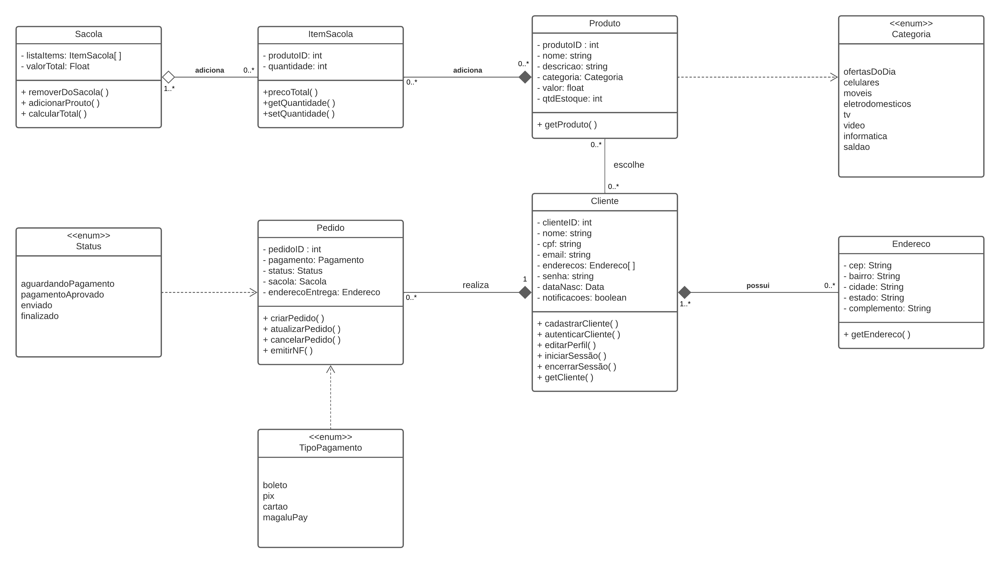
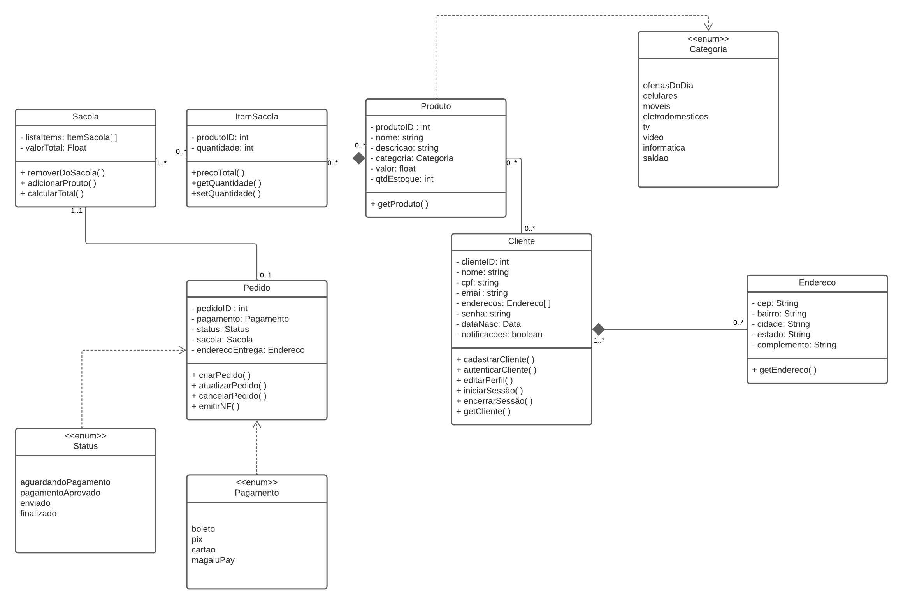

# Diagrama de Classes

## Introdução

O diagrama de classes, segundo Segundo Guedes (2008)[¹](#ancora1), é um dos elementos mais importantes e utilizados na UML. Seu principal objetivo é permitir a visualização das classes que compõem o sistema, juntamente com seus atributos e métodos correspondentes. Além disso, ele demonstra as relações, complementos e troca de informações entre as classes presentes no diagrama. Essencialmente, esse diagrama oferece uma visão estática da organização das classes, focando na definição de sua estrutura lógica. Além disso, o diagrama de classes serve como base para a construção da maioria dos outros diagramas na linguagem UML.

## Metodologia

Realizamos uma reunião por meio do Discord, na qual discutimos detalhadamente as tarefas a serem executadas. Após um debate, nossa equipe se conectou à plataforma Lucid para iniciar o desenvolvimento do artefato. Juntos, trabalhamos de forma colaborativa e eficiente para criar o artefato, aproveitando as funcionalidades da plataforma e garantindo um resultado de qualidade.

## Diagrama de Classes

#### Versão 2.0

Figura 1: Diagrama de Classes Versão 2.0

#### Versão 1.0

Figura 2: Diagrama de Classes Versão 1.0

## Conclusão

O artefato do diagrama de classes ofereceu ao grupo uma visão mais clara e concisa da estrutura das entidades e de suas interações no sistema. Isso nos permitiu uma compreensão aprofundada das regras de negócios, facilitando a transformação de ideias em classes, relacionamentos, atributos e métodos, além de uma descrição precisa dos padrões de projeto aplicados no projeto.

## Referências Biblgráficas

>  1. GILLEANES T A GUEDES. UML : uma abordagem prática. São Paulo: Novatec, 2008.  
> 2. KIRILL FAKHROUTDINOV. UML Class Diagrams - Graphical Notation Reference. Disponível em: <https://www.uml-diagrams.org/class-reference.html>.

## Histórico de Versões

| Versão | Descrição                                                                | Responsável                                                                                                                                                                                        | Revisor                                          | Data       |
| ------ | ------------------------------------------------------------------------ | -------------------------------------------------------------------------------------------------------------------------------------------------------------------------------------------------- | ------------------------------------------------ | ---------- |
| 1.0    | Criação do artefato                                                      | [Hellen Fernanda](https://github.com/Hellen159), [Laura Pinos](https://github.com/laurapinos), [Maciel Júnior](https://github.com/macieljuniormax), [Sidney Fernando](https://github.com/nando3d3) | [Débora Caires](https://github.com/deboracaires) | 06/10/2023 |
| 1.1    | Atualização na introdução                                                | [Hellen Fernanda](https://github.com/Hellen159), [Laura Pinos](https://github.com/laurapinos), [Maciel Júnior](https://github.com/macieljuniormax), [Sidney Fernando](https://github.com/nando3d3) |
| 2.0    | Adiciona semântica ao diagrama, corrige a relação entre pedido e cliente | [Hellen Fernanda](https://github.com/Hellen159), [Laura Pinos](https://github.com/laurapinos), [Maciel Júnior](https://github.com/macieljuniormax), [Sidney Fernando](https://github.com/nando3d3) |                                                  |            |
|        |
