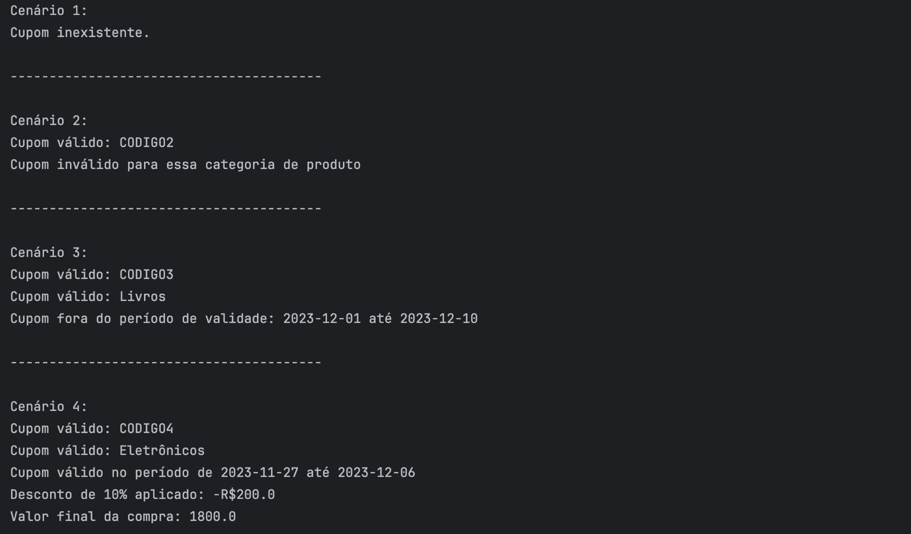

# GOF - Chain of Responsibility

## Introdução
O padrão de projeto Chain of Responsibility, ou Cadeia de Responsabilidade em português, representa outra peça fundamental no arsenal de padrões comportamentais da programação orientada a objetos [¹](#ancora1). Este padrão visa criar uma cadeia de objetos que podem tratar solicitações de maneira independente. Cada objeto na cadeia possui a capacidade de processar a solicitação ou passá-la adiante na cadeia, permitindo que diferentes partes do sistema tratem a solicitação de forma flexível.

A estrutura do padrão Chain of Responsibility é composta por handlers (manipuladores) que formam uma sequência. Cada handler tem a responsabilidade de processar uma parte específica da solicitação e decidir se a manipula ou a encaminha para o próximo handler na cadeia. Isso promove a redução do acoplamento entre os componentes e permite que novos handlers sejam adicionados ou removidos sem afetar o restante da cadeia.

Ao utilizar o Chain of Responsibility, um pedido percorre a cadeia até que um handler o processe ou até o final da cadeia ser alcançado. Essa abordagem é valiosa em cenários nos quais diferentes componentes podem lidar com uma solicitação, e a escolha do handler apropriado depende da situação.

## Metodologia
Na fase inicial do projeto, os participantes realizaram uma revisão do conteúdo, dedicando tempo a estudos individuais sobre o sistema de compras da plataforma em foco neste trabalho. Após essa etapa, ocorreu uma reunião virtual via Discord em 28/11/2023, com duração de quatro horas.

Nesse primeiro encontro, todas as informações coletadas durante o estudo individual foram discutidas em detalhes. A partir dessas discussões, decidiu-se pela implementação do padrão Chain of Responsibility na fase de aplicação de cupons, e também foi iniciado o desenvolvimento da problemática, solução e esboços da UML.

Posteriormente, os participantes se reuniram novamente em 29/11/2023, em uma sessão de três horas. Durante esse encontro, concentraram-se na elaboração deste documento e na implementação do código do artefato em questão.

## Problemática e Solução

### Problemática
No contexto do sistema de compras da plataforma, identificou-se a necessidade de implementar um mecanismo flexível para a aplicação de cupons, onde diferentes tipos de validações e descontos podem ser aplicados de forma dinâmica e independente. A complexidade reside na variedade de condições que podem ser associadas aos cupons, como a validação da existência do cupom, a verificação da data de aplicação, a validação do tipo de produto e a aplicação de descontos baseados no valor da compra.

### Solução
Para lidar com a problemática identificada, optou-se por implementar o padrão de projeto Chain of Responsibility na fase de aplicação de cupons no sistema de compras. A solução consiste em criar uma cadeia de manipuladores (CupomHandler), onde cada manipulador tem a responsabilidade de realizar uma parte específica da validação ou aplicação de desconto associada ao cupom.

* ValidarExistencia: Responsável por validar a existência do cupom com base no nome fornecido.

* ValidarData: Responsável por verificar se a data atual está dentro do período de validade do cupom.

* ValidarTipoProduto: Responsável por validar se os produtos no carrinho correspondem ao tipo especificado no cupom.

* AplicarDesconto: Responsável por aplicar descontos com base no valor total da compra.

Cada manipulador na cadeia possui a capacidade de processar a solicitação (validar o cupom) e passá-la adiante para o próximo manipulador na cadeia ou interromper a cadeia caso identifique invalidade do cupom. Essa abordagem proporciona uma solução flexível e extensível, permitindo que novos tipos de validações sejam adicionados para lidar com novos tipos de cupons, sem afetar o restante do sistema. A cadeia de responsabilidade oferece uma divisão clara de responsabilidades, facilitando a manutenção e a evolução do sistema no que diz respeito à lógica de aplicação de cupons.

## UML

<div class="mermaid"> 
classDiagram
class CupomHandler{
    &#60;&#60;interface&#62;&#62;
    + validarCupom(Cupom cupomBaseDeDados, Cupom cupomUsuario) void
    + setProximo(cupomHandler: CupomHandler) void
}
class ValidarExistencia{
    - proximo: CupomHandler
    - Cupom[] cuponsExistentes
    + validarCupom(Cupom cupomBaseDeDados, Cupom cupomUsuario) void
    + setProximo(cupomHandler: CupomHandler) void
}
class ValidarData{
    - dataAtual: LocalDate
    - proximo: CupomHandler
    + validarCupom(Cupom cupomBaseDeDados, Cupom cupomUsuario) void
    + setProximo(cupomHandler: CupomHandler) void
}
class ValidarTipoProduto{
    - proximo: CupomHandler
    + validarCupom(Cupom cupomBaseDeDados, Cupom cupomUsuario) void
    + setProximo(cupomHandler: CupomHandler) void
}
class AplicarDesconto{
    - valorCompra: double
    - proximo: CupomHandler
    + validarCupom(Cupom cupomBaseDeDados, Cupom cupomUsuario) void
    + setProximo(cupomHandler: CupomHandler) void
}
Client --> CupomHandler : Manda comando
CupomHandler <|.. ValidarExistencia
CupomHandler <|.. ValidarData
CupomHandler <|.. ValidarTipoProduto
CupomHandler <|.. AplicarDesconto
</div>
<div style="text-align:center;">
Figura 1: UML Chain Of Responsibility
</div>

O diagrama de classes representado pela Figura 1 acima* reflete a arquitetura implementada para a aplicação do padrão de projeto Chain of Responsibility no sistema de compras da plataforma. A seguir, uma explicação detalhada dos principais elementos do diagrama:

* CupomHandler (Interface): A interface CupomHandler define o contrato para os manipuladores que compõem a cadeia de responsabilidade. Contém métodos para validar o cupom (validarCupom) e configurar o próximo manipulador na cadeia (setProximo).
* ValidarExistencia, ValidarData, ValidarTipoProduto, AplicarDesconto (Classes Concretas):
  * Cada uma dessas classes implementa a interface CupomHandler, representando um manipulador específico na cadeia.
  * Atributos específicos, como nome, dataAtual, cuponsExistentes e valorCompra, são utilizados para armazenar informações relevantes para a lógica de validação ou aplicação de desconto.
* Client (Cliente): A classe Client interage com o manipulador inicial da cadeia, enviando comandos para validar o cupom. Esta classe representa o ponto de entrada para a aplicação do padrão.
* Relacionamentos:
  * O relacionamento entre Client e CupomHandler indica a interação entre o cliente e o manipulador inicial da cadeia.
  * Os relacionamentos CupomHandler e ValidarExistencia, CupomHandler e ValidarData, CupomHandler e ValidarTipoProduto, CupomHandler e AplicarDesconto representam a relação de implementação, indicando que cada uma dessas classes concretas implementa a interface CupomHandler.
* Funcionamento: A cadeia de responsabilidade é estabelecida pela interconexão dos manipuladores, onde cada manipulador decide se deve processar a solicitação (validar o cupom ou aplicar desconto) ou passá-la adiante para o próximo manipulador na cadeia. Essa abordagem permite uma aplicação flexível de cupons, onde diferentes tipos de validações e descontos podem ser aplicados de maneira dinâmica e independente.

O diagrama de classes proporciona uma visão clara da estrutura do padrão Chain of Responsibility implementado, oferecendo uma solução para a aplicação de cupons no contexto do sistema de compras da plataforma.

## Código

O código a seguir representa uma implementação prática do padrão de projeto Chain of Responsibility na funcionalidade de aplicação de cupons. Este padrão é utilizado para promover uma abordagem flexível e desacoplada na manipulação de solicitações, permitindo que diferentes objetos processem uma cadeia de responsabilidades.

A classe BaseDeDadosCupons é responsável por criar e fornecer uma coleção de instâncias de cupons predefinidos. Esses cupons são então processados por uma implementação do padrão Chain of Responsibility, onde cada elo da corrente lida com um tipo específico de cupom.

```BaseDeDadosCupons.java
import java.time.LocalDate;

public class BaseDeDadosCupons {
    public static Cupom[] getCupons() {
        Cupom cupom1 = new Cupom();
        cupom1.setCodigo("CODIGO1");
        cupom1.setTipoProduto("Eletrônicos");
        cupom1.setDataInicio(LocalDate.now().minusDays(2));
        cupom1.setDataFim(LocalDate.now().plusDays(5));
        cupom1.setPorcentagemDesconto(15);

        Cupom cupom2 = new Cupom();
        cupom2.setCodigo("CODIGO2");
        cupom2.setTipoProduto("Roupas");
        cupom2.setDataInicio(LocalDate.now().minusDays(1));
        cupom2.setDataFim(LocalDate.now().plusDays(7));
        cupom2.setPorcentagemDesconto(10);

        Cupom cupom3 = new Cupom();
        cupom3.setCodigo("CODIGO3");
        cupom3.setTipoProduto("Livros");
        cupom3.setDataInicio(LocalDate.now().plusDays(1));
        cupom3.setDataFim(LocalDate.now().plusDays(10));
        cupom3.setPorcentagemDesconto(20);

        Cupom cupom4 = new Cupom();
        cupom4.setCodigo("CODIGO4");
        cupom4.setTipoProduto("Eletrônicos");
        cupom4.setDataInicio(LocalDate.now().minusDays(3));
        cupom4.setDataFim(LocalDate.now().plusDays(6));
        cupom4.setPorcentagemDesconto(10);

        Cupom cupom5 = new Cupom();
        cupom5.setCodigo("CODIGO5");
        cupom5.setTipoProduto("Roupas");
        cupom5.setDataInicio(LocalDate.now().minusDays(1));
        cupom5.setDataFim(LocalDate.now().plusDays(4));
        cupom5.setPorcentagemDesconto(18);

        Cupom cupom6 = new Cupom();
        cupom6.setCodigo("CODIGO6");
        cupom6.setTipoProduto("Livros");
        cupom6.setDataInicio(LocalDate.now().minusDays(2));
        cupom6.setDataFim(LocalDate.now().plusDays(8));
        cupom6.setPorcentagemDesconto(15);

        return new Cupom[]{cupom1, cupom2, cupom3, cupom4, cupom5, cupom6};
    }
}
```
A classe Carrinho foi projetada com simplicidade, mantendo apenas a informação do valor total da compra. No contexto dessa implementação, ela foi desenvolvida para simular o valor que já estaria armazenado no banco de dados, representando o montante total da compra que o usuário estaria tentando realizar.

```Carrinho.java
class Carrinho {
    private double valor;

    public Carrinho(double valor) {
        this.valor = valor;
    }

    public double getValor() {
        return valor;
    }

    public void setValor(double valor) {
        this.valor = valor;
    }
}
```

A classe Cupom descreve a estrutura fundamental para representar informações associadas a descontos dentro do sistema. Essa classe é crucial para a implementação do padrão Chain of Responsibility, uma vez que cada instância de cupom será processada por elos consecutivos da corrente, aplicando ou não um desconto no final da cadeia.

```Cupom.java
import java.time.LocalDate;

public class Cupom {
    private String codigo;
    private LocalDate dataInicio;
    private LocalDate dataFim;
    private String tipoProduto;
    private int porcentagemDesconto;

    public Cupom() {
    }

    public String getCodigo() {
        return codigo;
    }

    public void setCodigo(String codigo) {
        this.codigo = codigo;
    }

    public LocalDate getDataInicio() {
        return dataInicio;
    }

    public void setDataInicio(LocalDate dataInicio) {
        this.dataInicio = dataInicio;
    }

    public LocalDate getDataFim() {
        return dataFim;
    }

    public void setDataFim(LocalDate dataFim) {
        this.dataFim = dataFim;
    }

    public String getTipoProduto() {
        return tipoProduto;
    }

    public void setTipoProduto(String tipoProduto) {
        this.tipoProduto = tipoProduto;
    }

    public int getPorcentagemDesconto() {
        return porcentagemDesconto;
    }

    public void setPorcentagemDesconto(int porcentagemDesconto) {
        this.porcentagemDesconto = porcentagemDesconto;
    }
}
```
 A interface CupomHandler define um contrato que os manipuladores de cupons devem seguir, estabelecendo métodos essenciais para validar cupons e estabelecer a referência para o próximo manipulador na corrente.

* validarCupom: Este método é responsável por validar se um cupom específico é aplicável ao contexto da compra. Ao comparar o cupom fornecido pelo usuário com um cupom da base de dados, este método determina se o cupom atende aos critérios de validação de cada manipulador.

* setProximo: Este método estabelece a referência para o próximo manipulador na corrente.

```CupomHandler.java
public interface CupomHandler {
    public void validarCupom(Cupom cupomBaseDeDados, Cupom cupomUsuario);
    public void setProximo(CupomHandler cupomHandler);
}
```
A classe ValidarExistencia é uma implementação concreta da interface CupomHandler no contexto de validação de cupons. Este manipulador específico tem como função verificar se um cupom fornecido pelo usuário existe na base de dados de cupons. Caso o cupom seja identificado, a validação é considerada bem-sucedida, e a informação sobre a existência é transmitida ao próximo elo da corrente.

* Método validarCupom:

  * O método validarCupom percorre a lista de cupons existentes, comparando os códigos dos cupons da base de dados com o código do cupom fornecido pelo usuário. Se um cupom correspondente é encontrado, a variável cupomExiste é definida como verdadeira, e o cupom encontrado é armazenado para referência futura.

  * Se o cupom existe, uma mensagem indicando a validade do cupom é exibida no console. Caso contrário, uma mensagem informando a inexistência do cupom é exibida, e a execução do método é encerrada.

```ValidarExistencia.java
public class ValidarExistencia implements CupomHandler {
    private CupomHandler proximo;
    private Cupom[] cuponsExistentes = BaseDeDadosCupons.getCupons();

    public ValidarExistencia() {}

    @Override
    public void validarCupom(Cupom cupomBaseDeDados, Cupom cupomUsuario) {
        boolean cupomExiste = false;
        Cupom cupomEncontrado = null;

        for (Cupom cupomExistente : cuponsExistentes) {
            if (cupomUsuario != null) {
                if (cupomExistente.getCodigo().equals(cupomUsuario.getCodigo())) {
                    cupomExiste = true;
                    cupomEncontrado = cupomExistente;
                    break;
                }
            }
        }

        if (cupomExiste) {
            System.out.println("Cupom válido: " + cupomEncontrado.getCodigo());
        } else {
            System.out.println("Cupom inexistente." );
            return;
        }
        if (proximo != null) {
            proximo.validarCupom(cupomEncontrado, cupomUsuario);
        }
    }

    @Override
    public void setProximo(CupomHandler cupomHandler) {
        this.proximo = cupomHandler;
    }
}
```

A classe ValidarData é uma implementação da interface CupomHandler destinada a verificar se um cupom está dentro de seu período de validade. Integrada à corrente de responsabilidade, este manipulador específico contribui para a lógica de processamento de cupons, priorizando a verificação de datas.

* Método validarCupom:

    * O método validarCupom utiliza a data atual obtida através de LocalDate.now() e compara com as datas de início e término de validade do cupom fornecido pela base de dados. Se a data atual estiver dentro do intervalo especificado pelo cupom, a validação é bem-sucedida, e uma mensagem indicando a validade do cupom no período é exibida no console. Caso contrário, uma mensagem informando que o cupom está fora do período de validade é exibida, e a execução do método é encerrada.

```ValidarData.java
import java.time.LocalDate;

public class ValidarData implements CupomHandler {
    private LocalDate dataAtual = LocalDate.now();
    private CupomHandler proximo;

    public ValidarData() {}

    @Override
    public void validarCupom(Cupom cupomBaseDeDados, Cupom cupomUsuario) {
        LocalDate dataInicio = cupomBaseDeDados.getDataInicio();
        LocalDate dataFim = cupomBaseDeDados.getDataFim();

        if (dataInicio != null && dataFim != null &&
                !dataAtual.isBefore(dataInicio) && !dataAtual.isAfter(dataFim)) {
            System.out.println("Cupom válido no período de " + dataInicio + " até " + dataFim);
        } else {
            System.out.println("Cupom fora do período de validade: " + dataInicio + " até " + dataFim);
            return;
        }

        if (proximo != null) {
            proximo.validarCupom(cupomBaseDeDados, cupomUsuario);
        }
    }

    @Override
    public void setProximo(CupomHandler cupomHandler) {
        this.proximo = cupomHandler;
    }
}
```

A classe ValidarTipoProduto é uma implementação da interface CupomHandler, focada na validação do tipo de produto associado a um cupom.

* Método validarCupom:

  * O método validarCupom compara o tipo de produto especificado no cupom da base de dados (cupomBaseDeDados) com o tipo de produto obtido pelo usuário (cupomUsuario). Se houver correspondência, o desconto é considerado válido, e uma mensagem indicando a validade é exibida no console. Caso contrário, uma mensagem informando que o cupom não é válido para a categoria de produto escolhida é exibida, e a execução do método é encerrada.

```ValidarTipoProduto.java
public class ValidarTipoProduto implements CupomHandler {
    private CupomHandler proximo;

    public ValidarTipoProduto() {}

    @Override
    public void validarCupom(Cupom cupomBaseDeDados, Cupom cupomUsuario) {
        boolean cupomExiste = cupomBaseDeDados.getTipoProduto().equals(cupomUsuario.getTipoProduto());

        if (cupomExiste) {
            System.out.println("Cupom válido: " + cupomUsuario.getTipoProduto());
        } else {
            System.out.println("Cupom inválido para essa categoria de produto");
            return;
        }
        if (proximo != null) {
            proximo.validarCupom(cupomBaseDeDados, cupomUsuario);
        }
    }

    @Override
    public void setProximo(CupomHandler cupomHandler) {
        this.proximo = cupomHandler;
    }
}
```

A classe AplicarDesconto é mais uma implementação da interface CupomHandler. Essa classe é responsável por aplicar o desconto ao valor da compra com base nas informações do cupom. 

* Método validarCupom:

  * O método validarCupom verifica se o cupom da base de dados (cupomBaseDeDados) não é nulo e se o percentual de desconto associado a ele é maior que zero. Se essas condições forem atendidas, o desconto é aplicado ao valor total da compra.

  * O valor do desconto é calculado multiplicando o percentual de desconto pelo valor total da compra. Em seguida, são exibidas mensagens no console informando sobre a aplicação do desconto e o valor final da compra após o desconto.

```AplicarDesconto.java
public class AplicarDesconto implements CupomHandler{
    private double valorCompra = new Carrinho(2000.00).getValor();
    private CupomHandler proximo;

    public AplicarDesconto() {}
    @Override
    public void validarCupom(Cupom cupomBaseDeDados, Cupom cupomUsuario) {
        if (cupomBaseDeDados != null && cupomBaseDeDados.getPorcentagemDesconto() > 0) {
            double percentualDesconto = cupomBaseDeDados.getPorcentagemDesconto() / 100.0;
            double valorDesconto = percentualDesconto * this.valorCompra;

            System.out.println("Desconto de " + cupomBaseDeDados.getPorcentagemDesconto() + "% aplicado: -R$" + valorDesconto);

            System.out.println("Valor final da compra: " + (this.valorCompra - valorDesconto));
        }

        if (proximo != null) {
            proximo.validarCupom(cupomBaseDeDados, cupomUsuario);
        }

    }

    @Override
    public void setProximo(CupomHandler cupomHandler) {
        this.proximo = cupomHandler;
    }
}
```

O código na classe Main, que é representada por Client no UML, demonstra a utilização do padrão Chain of Responsibility para validar e aplicar descontos com base em uma cadeia de critérios. A seguir estão os cenários que são testados no código:

* Cenário 1: Cupom inválido devido à falta de código:

    Cria um cupom (cupomInvalidoSemCodigo) sem código.
    A corrente de responsabilidade verifica a existência do cupom, que resulta em um cupom inválido devido à ausência de código.

* Cenário 2: Cupom inválido devido ao tipo de produto incorreto:

    Cria um cupom (cupomInvalidoTipoProduto) com um tipo de produto diferente do esperado.
    A corrente de responsabilidade valida a existência do cupom, verifica o tipo de produto e conclui que o cupom é inválido.

* Cenário 3: Cupom inválido devido à data fora do intervalo:

    Cria um cupom (cupomInvalidoDataForaIntervalo) com uma data que está fora do intervalo de validade.
    A corrente de responsabilidade valida a existência, verifica o tipo de produto e verifica a data e conclui que o cupom é inválido devido à data fora do intervalo.

* Cenário 4: Cupom válido, passando por todas as validações:

    Cria um cupom (cupomValido) que atende a todos os critérios de validação.
    A corrente de responsabilidade valida a existência, verifica o tipo de produto, a data e, finalmente, aplica o desconto.

Cada cenário demonstra como a corrente de responsabilidade processa os cupons de acordo com os manipuladores específicos associados a cada critério. Este design permite uma extensibilidade fácil e a possibilidade de adicionar ou modificar comportamentos de validação sem modificar diretamente as classes existentes.

```
import java.time.LocalDate;

public class Main {
    public static void main(String[] args) {

        CupomHandler validarExistencia = new ValidarExistencia();
        CupomHandler validarTipoProduto = new ValidarTipoProduto();
        CupomHandler validarData = new ValidarData();
        CupomHandler aplicarDesconto = new AplicarDesconto();
        // Definir a ordem da cadeia de responsabilidade
        validarExistencia.setProximo(validarTipoProduto);
        validarTipoProduto.setProximo(validarData);
        validarData.setProximo(aplicarDesconto);

        // Cenário 1: Cupom inválido devido à falta de código
        Cupom cupomInvalidoSemCodigo = new Cupom();
        validarExistencia.validarCupom(null, cupomInvalidoSemCodigo);
        System.out.println("\n----------------------------------------\n");

        // Cenário 2: Cupom inválido devido ao tipo de produto incorreto
        Cupom cupomInvalidoTipoProduto = new Cupom();
        cupomInvalidoTipoProduto.setCodigo("CODIGO2");
        cupomInvalidoTipoProduto.setTipoProduto("Comida");
        validarExistencia.validarCupom(null, cupomInvalidoTipoProduto);
        System.out.println("\n----------------------------------------\n");

        // Cenário 3: Cupom inválido devido à data fora do intervalo
        Cupom cupomInvalidoDataForaIntervalo = new Cupom();
        cupomInvalidoDataForaIntervalo.setCodigo("CODIGO3");
        cupomInvalidoDataForaIntervalo.setTipoProduto("Livros");
        validarExistencia.validarCupom(null, cupomInvalidoDataForaIntervalo);
        System.out.println("\n----------------------------------------\n");

        // Cenário 4: Cupom válido, passando por todas as validações
        Cupom cupomValido = new Cupom();
        cupomValido.setCodigo("CODIGO4");
        cupomValido.setTipoProduto("Eletrônicos");
        validarExistencia.validarCupom(null, cupomValido);
    }
}
```
Na Figura 2 abaixo, apresenta-se o resultado da execução do código disponibilizado na classe Main anteriormente. Nos consoles, é possível visualizar que os cupons realmente seguem a cadeia de validação e interrompem a execução caso alguma etapa seja inválida.



<div style="text-align:center;">
Figura 2: Execução dos Cenários de teste
</div>

## Conclusão

A implementação do padrão de projeto Chain of Responsibility para o sistema de validação de cupons trouxe consigo desafios e aprendizados significativos para os participantes envolvidos no desenvolvimento. Ao refletir sobre essa experiência, destacam-se alguns pontos fundamentais:

1. Flexibilidade e Extensibilidade:

    O padrão Chain of Responsibility permitiu a criação de uma arquitetura flexível e extensível, na qual diferentes manipuladores podem ser adicionados ou removidos sem afetar o restante do sistema. Isso facilitou a adaptação a novos requisitos e cenários de validação de cupons.
2. Separação de Responsabilidades:

    A clara separação de responsabilidades entre os manipuladores permitiu que cada um se concentrasse em uma tarefa específica de validação. Isso resultou em um código mais modular, fácil de entender e manter, promovendo a coesão e a reutilização de código.

4. Testes de Cenários Diversificados:

    A elaboração de cenários de teste variados, como cupons inválidos e válidos em diferentes situações, permitiu validar a robustez e eficácia do sistema. Esses testes foram essenciais para identificar e corrigir potenciais problemas de lógica ou fluxo de execução.
    
5. Comunicação Eficiente:

    A comunicação entre os manipuladores e a capacidade de exibir mensagens detalhadas de validação no console proporcionaram uma ferramenta valiosa para depurar e compreender o comportamento do sistema em diferentes situações.

Desafios:

   * Um dos desafios enfrentados foi a definição adequada da ordem dos manipuladores na corrente, garantindo que a validação ocorresse de maneira sequencial e eficaz. O ajuste fino dessa ordem foi necessário para garantir o correto processamento dos cupons.

   * A gestão do estado do sistema e a transmissão de informações relevantes entre os manipuladores exigiram uma cuidadosa consideração para evitar redundâncias ou quebras no processamento.

Aprendizados:

   * Os participantes aprenderam a abordar a complexidade de validação de cupons de forma modular e escalonada, aplicando os princípios do padrão Chain of Responsibility.

   * A criação e execução de testes abrangentes foram fundamentais para garantir a confiabilidade do sistema, destacando a importância de abordagens robustas de teste em desenvolvimento de software.

   * A experiência proporcionou uma compreensão mais profunda dos benefícios de padrões de projeto na construção de sistemas que são flexíveis, fáceis de manter e capazes de se adaptar a mudanças nos requisitos.

Em suma, a implementação do Chain of Responsibility na funcionalidade de aplicação de cupons representou não apenas uma solução técnica eficaz, mas também uma oportunidade valiosa de aprendizado e aprimoramento das habilidades de design e desenvolvimento de software por parte dos participantes. Essa experiência contribuiu para a construção de um sistema mais robusto e escalonável, preparando os envolvidos para enfrentar desafios similares em futuros projetos.

## Referências Bibliográficas
> <a id="ancora1"></a> 1. Refactoring Guru. Chain of Responsibility. Disponível em: https://refactoring.guru/pt-br/design-patterns/chain-of-responsibility. Acesso em: 25 Nov 2023.

> <a id="ancora2"></a> 2. GAMMA, E. et al. Design Patterns. [s.l.]: Pearson Education, 1994.

> <a id="ancora3"></a> 3. MOREIRA, Diogo. Padrão Chain of Responsibility. Disponível em: https://diogomoreira.gitbook.io/padroes-de-projeto/padroes-gof-comportamentais/padrao-chain-of-responsibility. Acesso em: 28 Nov 2023. 

## Histórico de Versões
| Versão   | Descrição  | Responsável | Revisor    | Data      |
|----------|------------|-------------|------------|-----------|
| 1.0      | Criação da estrutura da página   | [Débora Moreira](https://github.com/deboracaires) e [Maciel Júnior](https://github.com/macieljuniormax) |  [Hellen Fernanda](https://github.com/Hellen159)  | 29/11/2023|
| 1.1      | UML e código implementados   | [Débora Moreira](https://github.com/deboracaires) e [Maciel Júnior](https://github.com/macieljuniormax) |  [Hellen Fernanda](https://github.com/Hellen159)  | 29/11/2023|
| 1.2      | Explicação código e conclusão   | [Débora Moreira](https://github.com/deboracaires) e [Maciel Júnior](https://github.com/macieljuniormax) |  [Hellen Fernanda](https://github.com/Hellen159)  | 30/11/2023|
