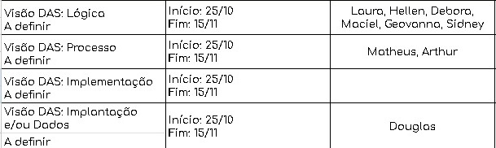

# Ata da reunião 4
### 21/11/2023

## Participantes presentes

- [x] [Arthur de Melo](https://github.com/arthurmlv)
- [x] [Débora Caires](https://github.com/deboracaires)
- [x] [Douglas Alves](https://github.com/dougAlvs)
- [x] [Geovanna Maciel](https://github.com/manuziny)
- [ ] [Hellen Fernanda](https://github.com/Hellen159)
- [x] [Laura Pinos](https://github.com/laurapinos)
- [ ] [Maciel Júnior](https://github.com/macieljuniormax)
- [x] [Matheus Henrique](https://github.com/mathonaut)
- [ ] [Sidney Fernando](https://github.com/nando3d3)

## Discussões e decisões
* No dia 21 de novembro fizemos uma reunião para planejar nossa próxima entrega do dia 01/12. Ficou decidido que até sexta (24/11) teriamos disponibilidade para fazer melhorias nos artefatos anteriores de acordo com as observações feitas e também esclarecer algumas dúvidas com a professora, e na outra semana implementariamos os códigos.

Sendo divididas as seguintes tarefas para cada integrante:

## Próxima Reunião
- 25/11 às 14h00

  ## Histórico de Versões

| Versão   | Descrição  | Responsável | Data      |
|----------|------------|-------------|------------|
| `1.0`    | Criação de ata Versão 1 | [Laura Pinos](https://github.com/laurapinos) | 23/11/2023|
